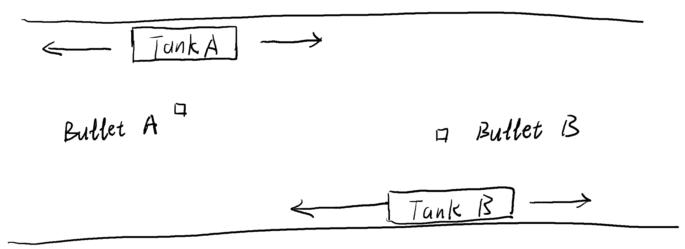
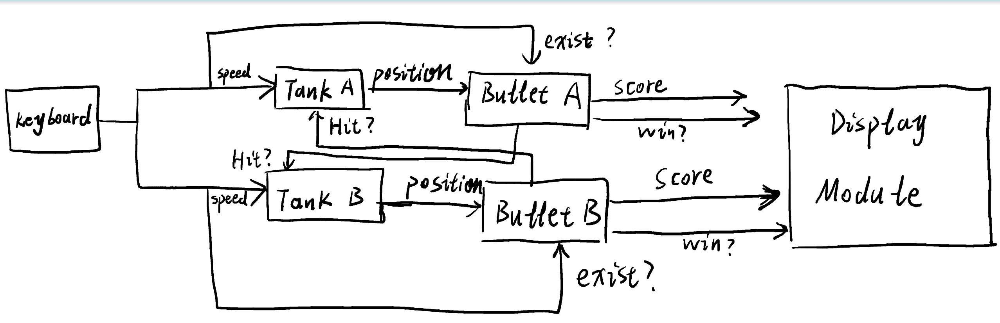
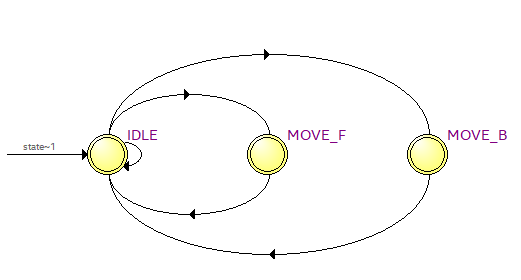
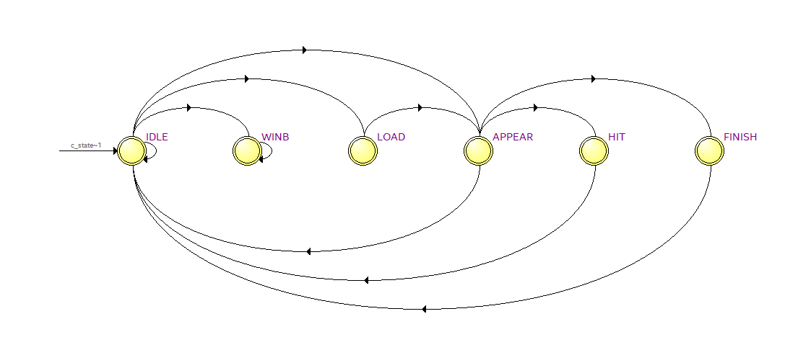
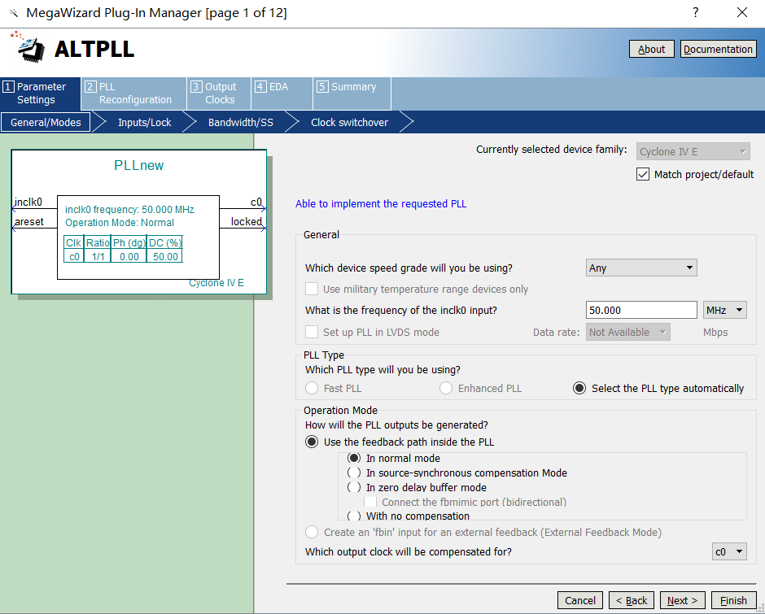

# FPGA-based-Pong-game
Implement Pong game on Altera DE2-115 board

Game example:
## Key features:
1. Hierarchical system structure design

   ### Flow and Components: 
   ### Source code:
   * Ps2: keyboard input signal capture, 3 speed signals for tank, 1 shoot signal for bullet.
   * Tank 1&2: tanks speed and coordinate control.
   * Bullet 1&2: bullets shooting control and score control.
   * Pixel_generator: generate pixels from tanks' and bullets' coordinates.
   * de2lcd: LCD module for score and win display.
   * Start_signal: generate 25HZ start signal for tanks and Bullet FSM.
   * PLL: phase-locked loop to increase the system clock from 50MHZ to 100MHZ.
   * VGA_top_level: Top-level module to wrap up all modules and display the game on VGA.
   
2. Finite State Machine(FSM) controls tank movement and bullet movement
   ### FSM for tanks:
   
   * update on every start signal
   ### FSM for Bullets:
   * LOAD: initial bullet coordinate
   * APPEAR: bullet moving
   * HIT:  bullet ends with score
   * FINISH: bullet ends with no score
   * WIN: score to 3 and win
3. Phase-locked loop(PLL) implementation to improve clock frequency
   * Synopsys Design Constraint(sdc) PLL.sdc file: to constrain the new 100MHZ clock we create.
   * Quartus PLL plug-ins for parameter settings:
   

   50MHZ system clock for keyboard,LCD and VGA.
     
   100MHZ PLL clock to get better performance for tanks and bullets FSM.
4. Scripts for simulation automation

   Using script to automate the simulation process:
   ```
   do sim.do
   ```
   Change simulation files in sim.do
   change waveform settings in wave.do
   
